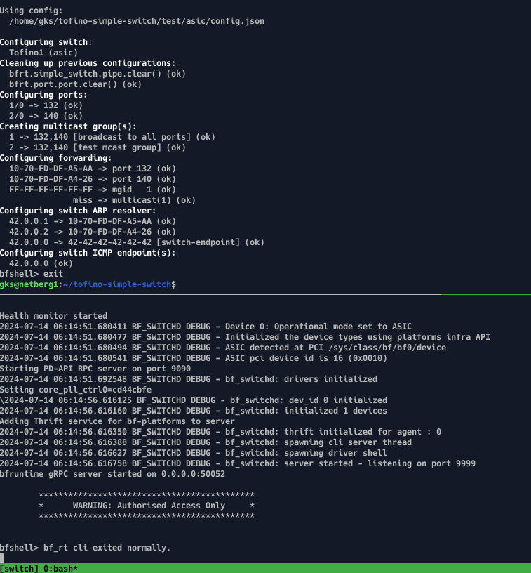

tofino-simple-switch
--------------------

Program Tofino as a simple switch with basic forwarding based on destination MAC address.
The switch is also an ARP resolver. That is, it will answer ARP requests for given IPs or drop the packets when not known.
The switch also has MAC and IP addresses of its own, and will respond to ARP and ICMP requests for those addresses.

The switch is programmed based on a static configuration file. That is, it is **NOT** a learning switch.
The files [tofino1.json](src/controller/tofino1.json) and [tofino2.json](src/controller/tofino2.json) are example configuration files.

## Usage

#### Configure the switch

To use this program on the real switch, first make sure the SDE is installed correctly the env. vars `$SDE` and `$SDE_INSTALL` are correcly set.

Then you need to create a configuration file. The easiest way is to modify the default configuration [test/asic/config.json](test/asic/config.json). When done the following will take care of everything:
```
make asic
```

and give your password when asked. If all went well, you should be seeing something like this:



At this point you can detach from the TMUX session with:

```
make asic-detach
```

After detatching you can re-attach with:

```
make asic-attach
```

To confirm that the ports are UP and running, you can type the following on the switchd terminal (bottom tmux pane):

```bash
bfshell> ucli
bf-sde> pm
bf-sde.pm> show
```

If all went well, you should be seeing something like this:


#### Configure the servers

TODO

The servers need to be reconfigured when either occurs:

1. The server is turned off/restarted
2. `switchd` is turned off/restarted

#### Notes

