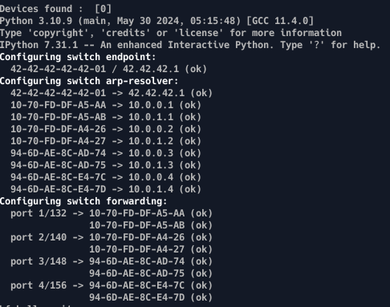
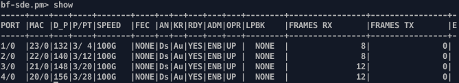

tofino-simple-switch
--------------------

Program Tofino as a simple switch with basic forwarding based on destination MAC address.
The switch is also an ARP resolver. That is, it will answer ARP requests for given IPs or drop the packets when not known.
The switch also has MAC and IP addresses of its own, and will respond to ARP and ICMP requests for those addresses.

The switch is programmed based on a static configuration file. That is, it is **NOT** a learning switch.
The files [tofino1.json](src/controller/tofino1.json) and [tofino2.json](src/controller/tofino2.json) are example configuration files.

#### Usage

To use this program on the real switch, first make sure the SDE is installed correctly the env. vars `$SDE` and `$SDE_INSTALL` are correcly set.

Then, SSH to the switch and start the user-space driver in a tmux session (connection lost -> driver killed -> no switch)
```bash
tmux -new -s switchd
```
then,
```bash
make p4
$SDE/run_switchd.sh -p simple_switch
```
Now open another terminal and SSH to the switch again, you don't need tmux for this, it will be fast.

```bash
$SDE/run_bfshell -b `pwd`/src/controller/bfrt_cli_config.py
```

If all went well, you should be seeing something like this:



Confirm the links are UP and running. On the switchd terminal type:

```bash
bfshell> ucli
bf-sde> pm
bf-sde.pm> show
```

If all went well, you should be seeing something like this:




#### Ports

One important thing to remember is that port numbering in Tofino1 and Tofino2 differ. In particular:

<table>
  <tr>
    <th></th>
    <th colspan="9">Front panel ports</th>
    <th>...</th>
    <th colspan="2">Special ports</th>
  </tr>
  <tr>
    <th>tofino 1</th>
    <td>0</td>
    <td>1</td>
    <td>2</td>
    <td>3</td>
    <td>4</td>
    <td>5</td>
    <td>6</td>
    <td>7</td>
    <td>8</td>
    <td>...</td>
    <td>64 (cpu port)</td>
    <td></td>
  </tr>
  <tr>
    <th>tofino 2</th>
    <td>8</td>
    <td>9</td>
    <td>10</td>
    <td>11</td>
    <td>12</td>
    <td>13</td>
    <td>14</td>
    <td>15</td>
    <td>16</td>
    <td>...</td>
    <td>2 (cpu port)</td>
    <td>???</td>
  </tr>
</table>

In other words Tofino1 special ports are >= 65 whereas in Tofino2 are in the range 0-8.

In most cases the following rule suffices to transfer programs between Tofino1 and Tofino2:

> Port N on Tofino1 is equivalent to Port N+8 on Tofino2.
> Except port 64 which corresponds to Tofino2 port number 2.

See also how [tofino1.json](src/controller/tofino1.json) and [tofino2.json](src/controller/tofino2.json) assign ports to hosts.

Usage
-----

TODO


