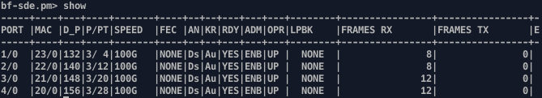

This file describes the inner workings of the switch and its programming.
This information is meant for P4 developers.
For a basic description of the switch as well as usage info, please see the [top-level README.md](../README.md)

### TODO


#### About Tofino ports

When programming Tofino, one needs to be careful about the use of the term *port*. There are two *kinds* of ports if you will

First we have the front panel QSFP connectors. On a Netberg Aurora 710 switch they look like this:
  ```
  Netberg Aurora 710
  +-----------------------------------------------------------------------------+
  |  PIPE 0                                PIPE 2                               |
  |  +-----+-----+-----+-----+             +------+------+------+------+        |
  |  |  1  |  3  |  5  |  7  |             |  17  |  19  |  21  |  23  |        |
  |  +-----+-----+-----+-----+   ....      +------+------+------+------+ ...    |
  |  |  2  |  4  |  6  |  8  |             |  18  |  20  |  22  |  24  |        |
  |  +-----+-----+-----+-----+             +------+------+------+------+        |
  +-----------------------------------------------------------------------------+
  ```
And then we have the ports used in a P4 program (e.g. to send a packet) to. We will refer to those as `dev_port`s.

Front panel ports can be used as one high-speed `dev_port` or split to multiple lower speed `dev_port`s each using diferent channels. There are enough `dev_port` ids available to account for possible port configurations.

Depending on the device, each front panel port corresponds to 4 to 8 `dev_port` ids. These `dev_port` ids are all available regardless of the port speed and it is up to the programmer to make sure packets are send to the correct one.
For instance, if we enable ports 1 and 2 from above as `100G` ports, then a possible `dev_port` id range for them is `1,2,3,4,5,6,7,8`. However, only `1` and `2` are valid because these are 4-channel ports.

The most important thing to remember is that the actual mapping between front panel ports and `dev_port` ids is not fixed and may differ per device/vendor.
For instance on Netberg Aurora 710, front panel port 1 maps to `dev_port` ids `132,133,134,135` with only `132` being usable on 100G mode, and port 2 maps to `dev_port` ids `140,141,142,143` with only `140` usable, as shown below (`D_P` column):



The only robust way to retrieve `dev_id`s is to query BFRutime.

For `bfrt_python` (CLI) one may use the following function to retrieve the `dev_id` for a `(port,channel)`

```
bfrt.port.port_hdl_info.get(CONN_ID=, CHNL_ID=)
```
For instance `bfrt.port.port_hdl_info.get(1, 0)` will return `132`. `bfrt.port.port_hdl_info.get(1, 1)` will return `133`, however this `dev_port` is not enabled since `132` is a 4-channel port.

The CLI controller uses the above function to set up ports [here](../src/controller/bfrt_cli.py?plain=1#L69)

##### Tofino1 vs Tofino2
<table>
  <tr>
    <th></th>
    <th colspan="9">Device ports (<code>$DEV_PORT</code>, <codE>D_P></code>, etc)</th>
    <th>...</th>
    <th colspan="2">Special ports</th>
  </tr>
  <tr>
    <th>tofino 1</th>
    <td>0</td>
    <td>1</td>
    <td>2</td>
    <td>3</td>
    <td>4</td>
    <td>5</td>
    <td>6</td>
    <td>7</td>
    <td>8</td>
    <td>...</td>
    <td>64 (cpu port)</td>
    <td></td>
  </tr>
  <tr>
    <th>tofino 2</th>
    <td>8</td>
    <td>9</td>
    <td>10</td>
    <td>11</td>
    <td>12</td>
    <td>13</td>
    <td>14</td>
    <td>15</td>
    <td>16</td>
    <td>...</td>
    <td>2 (cpu port)</td>
    <td>???</td>
  </tr>
</table>

In other words Tofino1 special ports are >= 65 whereas in Tofino2 are in the range 0-8.

In most cases the following rule suffices to transfer programs between Tofino1 and Tofino2:

> Port N on Tofino1 is equivalent to Port N+8 on Tofino2.
> Except port 64 which corresponds to Tofino2 port number 2.

##### Tofino model ports